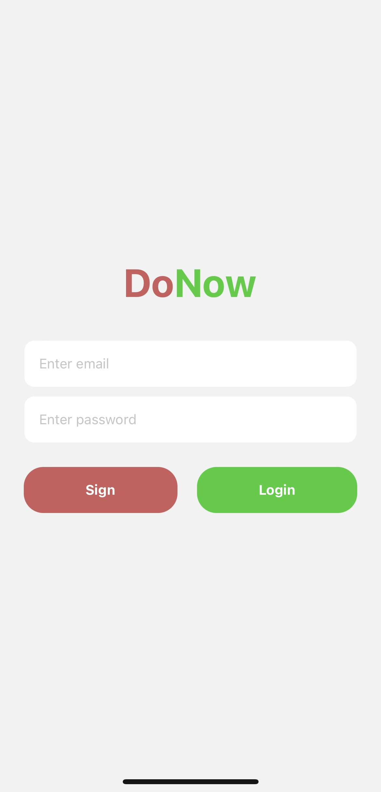
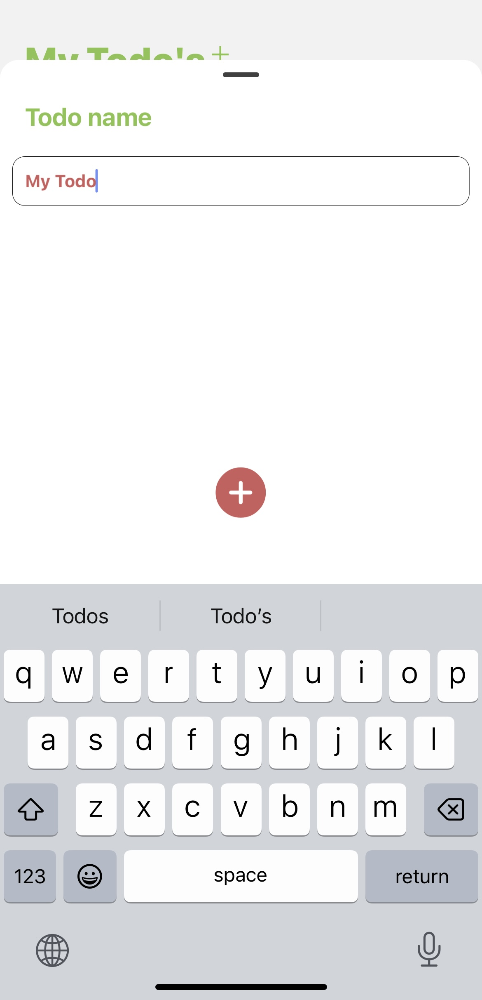
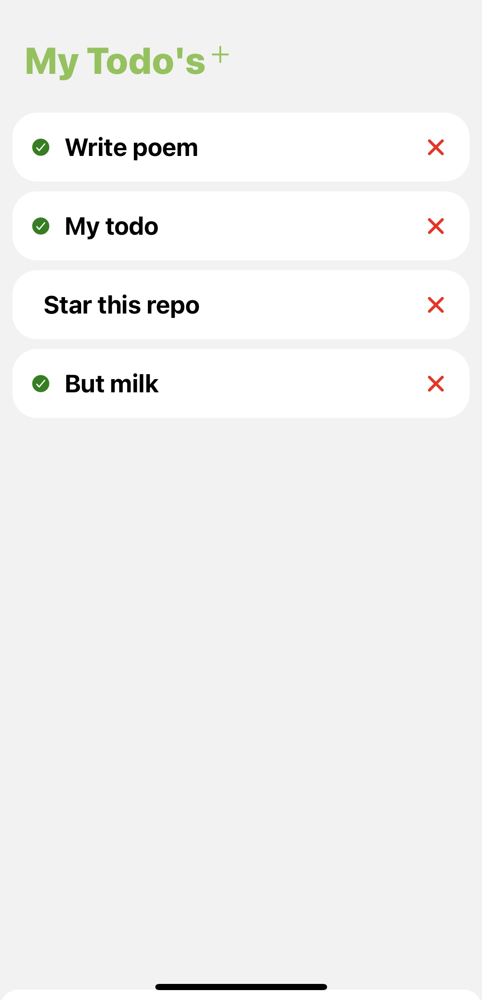

[](LICENSE)
[](https://github.com/ellerbrock/open-source-badges/)

# DoNow

DoNow is a simple React Native todo list app.

## Screenshots



## Installation

```bash
cd DoNow
npm i
```

#### Run project

```bash
npm start
```
## Authors

- [@stbestichhh](https://www.github.com/stbestichhh)


